# InkwellAi

InkwellAi is an advanced, multi-agent AI system for automated blog content creation and publishing. It orchestrates a team of specialized AI agents—Planner, Writer, Editor, and Publisher—to generate, refine, and distribute high-quality blog posts across multiple platforms with minimal human intervention.

## Features
- **Automated Blog Workflow:** From topic planning to final publication, every step is handled by a dedicated AI agent.
- **LLM-Powered Agents:** Each agent leverages a large language model (LLM) to perform its role—planning, writing, editing, or formatting content.
- **Multi-Platform Publishing:** Instantly publish your content to Dev.to (with Medium, LinkedIn, and Twitter support coming soon).
- **Configurable & Extensible:** Easily customize agents, tasks, and publishing tools via YAML and Python.
- **Seamless Orchestration:** The Crew orchestrator manages task flow, agent assignment, and data passing internally.

## Installation

Follow the official [CrewAI installation guide](https://docs.crewai.com/en/installation) for the latest instructions.

1. **Install `uv` (dependency manager):**
   ```bash
   # On macOS/Linux
   curl -LsSf https://astral.sh/uv/install.sh | sh
   # Or with wget
   wget -qO- https://astral.sh/uv/install.sh | sh
   ```
   For Windows and more details, see the [CrewAI docs](https://docs.crewai.com/en/installation).

2. **Install the `crewai` CLI:**
   ```bash
   uv tool install crewai
   ```
   To verify installation:
   ```bash
   uv tool list
   # You should see crewai listed
   ```
   To upgrade crewai:
   ```bash
   uv tool install crewai --upgrade
   ```

## Architecture Overview

```mermaid
flowchart TD
    subgraph Crew["🤖 Crew Orchestrator"]
        direction TB
        Input["User Input (topic, year)"]
        CrewTask1["Trigger Task: planner_task"]
        CrewTask2["Trigger Task: writer_task"]
        CrewTask3["Trigger Task: editor_task"]
        CrewTask4["Trigger Task: post_to_dev_task"]
        CrewTask5["Trigger Task: post_to_medium_task (Coming Soon)"]
        CrewTask6["Trigger Task: post_to_linkedin_task (Coming Soon)"]
        CrewTask7["Trigger Task: post_to_twitter_task (Coming Soon)"]
    end
    subgraph PlannerAgent["🧠 Planner Agent"]
        PlannerLLM["LLM: Generate outline"]
    end
    subgraph WriterAgent["✍️ Writer Agent"]
        WriterLLM["LLM: Write blog post"]
    end
    subgraph EditorAgent["📝 Editor Agent"]
        EditorLLM["LLM: Edit & polish"]
    end
    subgraph DevPosterAgent["🟣 Dev Poster Agent"]
        DevPosterLLM["LLM: Format for Dev.to"]
        DevToPostTool["DevToPostTool: Publish to Dev.to"]
    end
    subgraph MediumPosterAgent["🟢 Medium Poster Agent (Coming Soon)"]
        MediumPosterLLM["LLM: Format for Medium"]
        MediumPostTool["MediumPostTool: Publish to Medium"]
    end
    subgraph LinkedInPosterAgent["🔵 LinkedIn Poster Agent (Coming Soon)"]
        LinkedInPosterLLM["LLM: Format for LinkedIn"]
        LinkedInPostTool["LinkedInPostTool: Publish to LinkedIn"]
    end
    subgraph TwitterPosterAgent["🔷 Twitter Poster Agent (Coming Soon)"]
        TwitterPosterLLM["LLM: Format for Twitter"]
        TwitterPostTool["TwitterPostTool: Publish to Twitter"]
    end
    Input --> CrewTask1
    CrewTask1 --> PlannerAgent
    PlannerAgent --> PlannerLLM
    PlannerAgent --> CrewTask2
    CrewTask2 --> WriterAgent
    WriterAgent --> WriterLLM
    WriterAgent --> CrewTask3
    CrewTask3 --> EditorAgent
    EditorAgent --> EditorLLM
    EditorAgent --> CrewTask4
    EditorAgent --> CrewTask5
    EditorAgent --> CrewTask6
    EditorAgent --> CrewTask7
    CrewTask4 --> DevPosterAgent
    DevPosterAgent --> DevPosterLLM
    DevPosterAgent --> DevToPostTool
    DevPosterAgent --> Output1["✅ Dev.to URL & Status"]
    CrewTask5 --> MediumPosterAgent
    MediumPosterAgent --> MediumPosterLLM
    MediumPosterAgent --> MediumPostTool
    MediumPosterAgent --> Output2["⏳ Medium Output (Coming Soon)"]
    CrewTask6 --> LinkedInPosterAgent
    LinkedInPosterAgent --> LinkedInPosterLLM
    LinkedInPosterAgent --> LinkedInPostTool
    LinkedInPosterAgent --> Output3["⏳ LinkedIn Output (Coming Soon)"]
    CrewTask7 --> TwitterPosterAgent
    TwitterPosterAgent --> TwitterPosterLLM
    TwitterPosterAgent --> TwitterPostTool
    TwitterPosterAgent --> Output4["⏳ Twitter Output (Coming Soon)"]
```



## How It Works
1. **User provides a topic and year.**
2. **Planner Agent** (LLM) generates a detailed content outline.
3. **Writer Agent** (LLM) drafts a full blog post based on the outline.
4. **Editor Agent** (LLM) polishes the draft for clarity, grammar, and structure.
5. **Publisher Agents** use platform-specific tools to publish the final content:
   - **Dev.to** (fully integrated)
   - **Medium, LinkedIn, Twitter** (coming soon)

## Quickstart
1. **Install Python 3.10–3.13** and [UV](https://docs.astral.sh/uv/):
   ```bash
   pip install uv
   ```
2. **Install dependencies:**
   ```bash
   uv pip install -r requirements.txt
   ```
3. **Set your API keys** (e.g., `OPENAI_API_KEY`, `DEVTO_API_KEY`) in a `.env` file.
4. **Run the main workflow:**
   ```bash
   crewai run
   ```
   Or, if you prefer to run the Python entry point directly:
   ```bash
   python src/main.py
   ```
   This will generate a blog post and publish it to Dev.to.

## Configuration
- **Agents:** Define roles and behaviors in `src/config/agents.yaml`.
- **Tasks:** Define workflow steps in `src/config/tasks.yaml`.
- **Tools:** Add or customize publishing tools in `src/tools/blog_platform/`.

## Testing
Run tests to validate agent and task logic:
```bash
pytest tests/
```

## Development
For development dependencies:
```bash
pip install -r requirements-dev.txt
```

## Support
For questions or feedback:
- Email: ksatyam1038@gmail.com
- Website: [www.satyam.my](https://www.satyam.my)

---

InkwellAi: Automated, intelligent, and extensible blog creation for the modern web.