# InkwellAi

InkwellAi is an advanced, multi-agent AI system for automated blog content creation and publishing. It orchestrates a team of specialized AI agents—Planner, Writer, Editor, and Publisher—to generate, refine, and distribute high-quality blog posts across multiple platforms with minimal human intervention.

## Features
- **Automated Blog Workflow:** From topic planning to final publication, every step is handled by a dedicated AI agent.
- **LLM-Powered Agents:** Each agent leverages a large language model (LLM) to perform its role—planning, writing, editing, or formatting content.
- **Multi-Platform Publishing:** Instantly publish your content to Dev.to (with Medium, LinkedIn, and Twitter support coming soon).
- **Configurable & Extensible:** Easily customize agents, tasks, and publishing tools via YAML and Python.
- **Seamless Orchestration:** The Crew orchestrator manages task flow, agent assignment, and data passing internally.

## Installation

Follow the official [CrewAI installation guide](https://docs.crewai.com/en/installation) for the latest instructions.

1. **Install `uv` (dependency manager):**
   ```bash
   # On macOS/Linux
   curl -LsSf https://astral.sh/uv/install.sh | sh
   # Or with wget
   wget -qO- https://astral.sh/uv/install.sh | sh
   ```
   For Windows and more details, see the [CrewAI docs](https://docs.crewai.com/en/installation).

2. **Install the `crewai` CLI:**
   ```bash
   uv tool install crewai
   ```
   To verify installation:
   ```bash
   uv tool list
   # You should see crewai listed
   ```
   To upgrade crewai:
   ```bash
   uv tool install crewai --upgrade
   ```

## Architecture Overview

```mermaid
flowchart TD
    %% --- Style for white background and black text ---
    classDef white fill:#fff,stroke:#222,stroke-width:2px,color:#111;
    classDef output fill:#fff,stroke:#222,stroke-width:2px,color:#111;
    classDef tool fill:#fff,stroke:#222,stroke-width:2px,color:#111;

    %% --- Main Flow ---
    UserInput["<b>📝 User Input</b>"]:::white
    Orchestrator["<b>🤖 Crew Orchestrator</b>"]:::white
    PlannerAgent["<b>🧠 Planner Agent</b><br><i>LLM: Outline</i>"]:::white
    WriterAgent["<b>✍️ Writer Agent</b><br><i>LLM: Draft</i>"]:::white
    EditorAgent["<b>📝 Editor Agent</b><br><i>LLM: Edit</i>"]:::white
    DevPosterAgent["<b>🟣 Dev Poster Agent</b><br><i>LLM: Format</i>"]:::white
    MediumPosterAgent["<b>🟢 Medium Poster Agent</b><br><i>LLM: Format</i>\n<small>(Soon)</small>"]:::white
    LinkedInPosterAgent["<b>🔵 LinkedIn Poster Agent</b><br><i>LLM: Format</i>\n<small>(Soon)</small>"]:::white
    TwitterPosterAgent["<b>🔷 Twitter Poster Agent</b><br><i>LLM: Format</i>\n<small>(Soon)</small>"]:::white
    DevToPostTool["<b>🟣 DevToPostTool</b>"]:::tool
    MediumPostTool["<b>🟢 MediumPostTool</b>\n<small>(Soon)</small>"]:::tool
    LinkedInPostTool["<b>🔵 LinkedInPostTool</b>\n<small>(Soon)</small>"]:::tool
    TwitterPostTool["<b>🔷 TwitterPostTool</b>\n<small>(Soon)</small>"]:::tool
    Output1["<b>✅ Dev.to URL</b>"]:::output
    Output2["<b>⏳ Medium Output</b>\n<small>(Soon)</small>"]:::output
    Output3["<b>⏳ LinkedIn Output</b>\n<small>(Soon)</small>"]:::output
    Output4["<b>⏳ Twitter Output</b>\n<small>(Soon)</small>"]:::output
    BlogPost["<b>📄 blog_post.md</b>"]:::output

    %% --- Top-down, straight flow ---
    UserInput --> Orchestrator
    Orchestrator --> PlannerAgent
    PlannerAgent --> WriterAgent
    WriterAgent --> EditorAgent
    EditorAgent --> DevPosterAgent
    EditorAgent --> MediumPosterAgent
    EditorAgent --> LinkedInPosterAgent
    EditorAgent --> TwitterPosterAgent
    DevPosterAgent --> DevToPostTool
    DevToPostTool --> Output1
    DevPosterAgent --> BlogPost
    MediumPosterAgent --> MediumPostTool
    MediumPostTool --> Output2
    LinkedInPosterAgent --> LinkedInPostTool
    LinkedInPostTool --> Output3
    TwitterPosterAgent --> TwitterPostTool
    TwitterPostTool --> Output4
```



<!-- LEGEND: Horizontal, below the diagram for compatibility -->
**Legend:**  
🧑‍💻 Agents  🛠️ Tools  📤 Outputs  🤖 Crew Orchestrator  🟢/🔵/🔷 Coming Soon  🗂️ Config  💻 Entry  🧪 Test